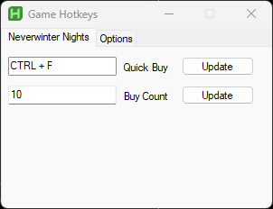
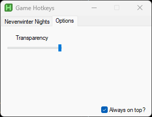

# NWNHotkeys
a small tool designed to help quickly buy multiples of an item from shops in the game Neverwinter Nights, this was made by myself specifically for use on a multiplayer server that gave permission for this tool to be used, and so i began this project both as a learning experience and to increase my quality of life when playing. However I did also try to design this to be as user friendly as possible for all end users not just myself.

 

# Requirements
To run this script you will need to have AutoHotkey V2 installed. after that is done you can goto [NWNHotkeys.ahk](NWNHotkeys.ahk) and either download it or copy and paste the contents into a text document and change the extention to `.ahk` when you run the file, assuming you installed AutoHotkey V2 you will see the tool pop up as shown in the images at the top of this document.

# How to use
simple to use, just run the script and the tool will open up, hover your mouse over the item you want to buy in game while the tool is running, then press `CTRL + F`. when you do this it will buy 10 of the item you had your mouse hovering over (assuming the shop has enough stock).

the tool also allows you to edit the amount of items you want to purchase by changing the number in the "Buy Count" box then hitting the update button, the same steps apply when changing the hotkey although you'll be enter a combination of keys instead of a number.

there is an options tab that will allow you to set the tool to always be on top of other windows, as well as a transparency bar to change the visibility of the window.

# Important
Please be sure if you wish to use this in a multiplayer server that you ask if it's allowed before doing so, any misuse  of this tool is your own fault and backlash due to that will be of your own making.

## Notes

When setting the hotkey, single keys are not permitted so as to avoid accidental activation.

The Buy Count box will only accept numbers.

the hotkey will only be active and functional when the game is in focus. By setting it up this way it allows you to set a hotkey that may otherwise normally be used in other applications without interferring with them for example, `CTRL + F` is the default key combination for the find function when using a text document or using a web browser. by locking the hotkey to only being live when the game is in focus, we allow you to keep using `CTRL + F` in those other applications without needing to first close down the tool.

Compiled `.exc` files **do not** require AutoHotkey V2 to be installed in order to run.
